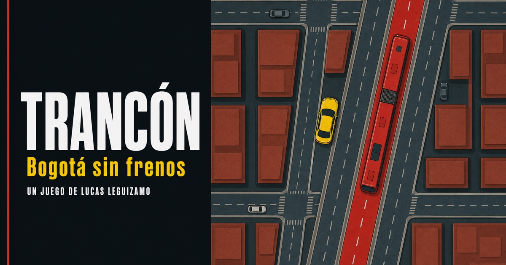
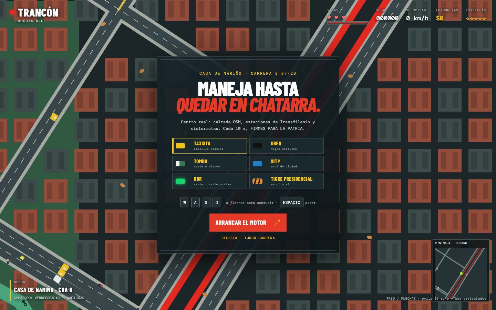
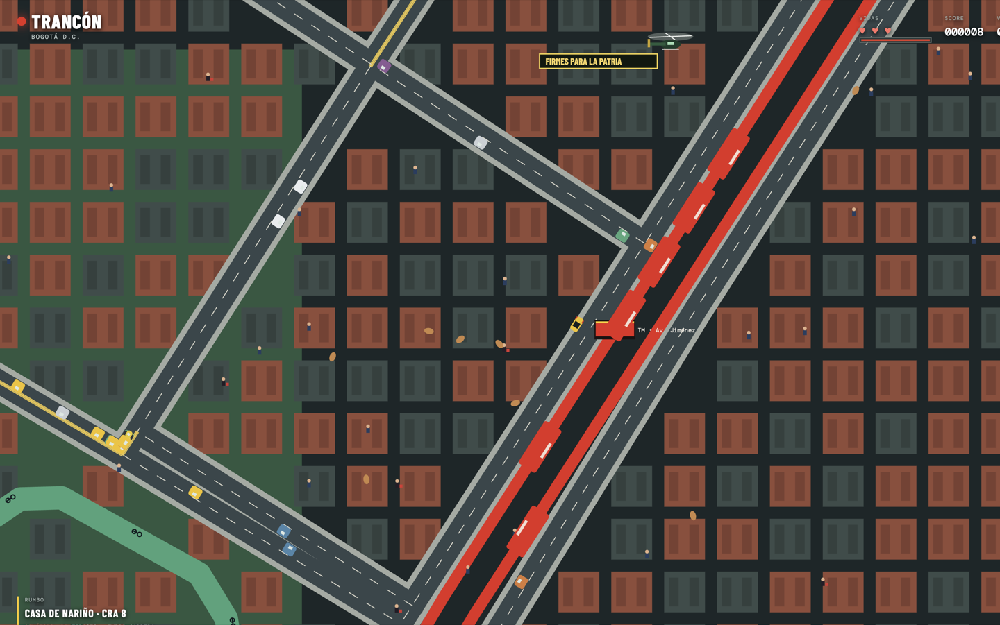

# Trancón

**Maneja por el centro real de Bogotá hasta quedar en chatarra.**

Un juego de **[Lucas Leguizamo](https://lucasleguizamo.com)**.

**Jugar:** [trancon.vercel.app](https://trancon.vercel.app)

<p align="center">
  
</p>

Sales de la Casa de Nariño. El TransMilenio te parte si te metes al carril. La fotomulta te cobra *$633.200* si pasas un cruce a más de 50 km/h. Cada diez segundos un helicóptero cruza la pantalla: *FIRMES PARA LA PATRIA*.

No es un grid infinito disfrazado de ciudad. Es calzada, troncal y ciclorruta del centro, horneadas desde OpenStreetMap. Cero API en runtime.

<p align="center">
  
</p>

```bash
pnpm install
pnpm dev
```

Abre la URL de Vite. Elige un vehículo. **Arranca el motor.** `WASD` o flechas. `Espacio` dispara el poder.

---

## Por qué se siente Bogotá

Cualquier endless-runner pone autos en una grilla. Trancón pone **la Carrera 8**, la troncal de Caracas y la estación Av. Jiménez.

| Detalle | En el juego |
|---|---|
| Spawn | Casa de Nariño, Carrera 8 #7-26 (`4.59543, -74.07752`) |
| Red | 1.316 vías, 177 tramos de TransMilenio, 52 ciclorrutas |
| Estaciones TM | Bicentenario, Tercer Milenio, San Victorino, Av. Jiménez, Museo del Oro, Las Aguas, Universidades, Calle 19, Calle 22 |
| Fotomulta C29 | Cruce + >50 km/h → *$633.200* |
| Helicóptero | Cada 10 s, pancarta *FIRMES PARA LA PATRIA* |
| Ladrones | Te quitan *$120*. Si los alcanzas, recuperas el botín |
| Semáforos | Verde / amarillo / rojo. La IA se para. Tú también deberías |

<p align="center">
  
</p>

---

## Seis maneras de morir en el centro

Cada skin cambia el color y **un poder**. El mapa no cambia: la ciudad no te hace favores.

| Vehículo | Poder | Lo que hace |
|---|---|---|
| **Taxista** | Turbo carrera | Empuje corto. El clásico amarillo. |
| **Uber** | Modo fantasma | Atraviesas el trancón un instante. |
| **Tombo** | Sirena | El tráfico cede. El TM no. |
| **SITP** | Prioridad azul | Escudo y un poco de respeto. |
| **RBR** | Pulso radiactivo | Radio Activa: el radio se pone lento y sumas puntos. |
| **Tigre presidencial** | Rugido | Dos escoltas. El carril se abre a la fuerza. |

Tres vidas. Choques con inercia, sacudida y partículas. Integridad a cero → chatarra → score. Reinicias sin recargar.

---

## Controles

| Tecla | Acción |
|---|---|
| `W` `A` `S` `D` o flechas | Acelerar, frenar, girar (con inercia) |
| `Espacio` | Poder del vehículo |
| Ratón | Elegir skin en el menú |

HUD: vidas, score, km/h, fotomultas, estrellas, semáforo del cruce y cooldown del poder. Minimapa del centro, abajo a la derecha.

---

## Cómo está armado

Un canvas 2D, un loop a `dt` limitado, coordenadas de mundo (`x/y` globales; la cámara solo traduce). Nada de tiles. Cada vía es una polilínea con carriles, sentido y ancho. El tráfico sigue la red, respeta semáforos y se detiene detrás del de adelante.

```
src/main.js                  juego: física, IA, HUD, poderes, render
src/world/network.js         consultas: calzada, TM, ciclovía, nearest
src/world/data/bogota.json   mapa horneado (no se toca a mano)
tools/build-bogota-map.py    OSM → JSON
docs/agents/                 contratos de cada rol
```

El extracto OSM vive en `tools/osm/`. El runtime **no llama a Overpass**. Si se cae internet, el centro sigue ahí.

Para recortar otra tajada (Calle 26, Chapinero, lo que venga) el plan vigente está en [`docs/agents/mapa_plan.md`](docs/agents/mapa_plan.md). Nadie implementa OSM sin ese plan.

### Stack

Vite 7 · Canvas 2D · JavaScript · Python para el horneado · datos © colaboradores de [OpenStreetMap](https://www.openstreetmap.org/copyright).

Arranca con `pnpm install && pnpm dev`. También vale `npm`.

---

## Lo que ya pasa QA

Corrido en partida real, no en captura:

- Conducción con inercia y cámara cenital que sigue al carro
- Ciudad continua (el mapa no se acaba al salir del spawn)
- Colisión, daño, tres vidas, game-over con score
- Articulados de TransMilenio, más largos y más duros
- Semáforos que la IA respeta
- Autos, motos, ciclas, peatones y perros en la misma red

Informe: [`docs/agents/QA_REPORT.md`](docs/agents/QA_REPORT.md).

---

## Hecho por un equipo de agentes

Trancón no salió de un prompt único. Cada rol tiene contrato en [`AGENTS.md`](AGENTS.md) y no pisa el del anterior:

`director` → `arquitecto` → `gameplay` → `mundo` → `trafico` → `arte_ux` → `qa` → `mapa_plan`

La regla: primero los ocho requisitos jugables, después el centro real, después extras. El spawn no se mueve de la Casa de Nariño hasta que la tajada siguiente esté recortada.

---

## Creador

**Lucas Leguizamo** — [lucasleguizamo.com](https://lucasleguizamo.com)

Código y dirección del proyecto. El mapa OSM se atribuye a sus colaboradores; el juego, no.

## Licencia

Código: [MIT](LICENSE), © Lucas Leguizamo.  
Geometría vial: [ODbL](https://www.openstreetmap.org/copyright) © OpenStreetMap contributors.

Si haces un fork, deja la atribución OSM. Sin esa red esto es otra grilla más.
